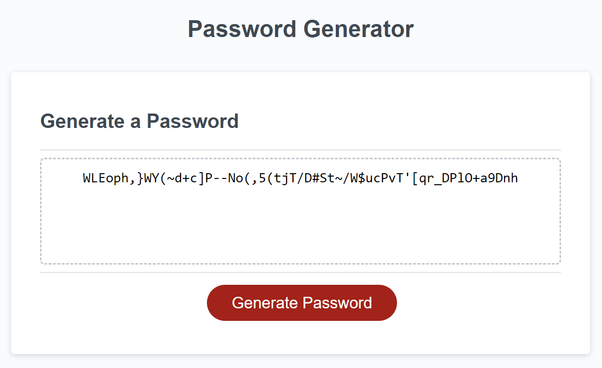

# Password-Generator-CristianB

Password genarator tool - part of Bootcamp challenge

## Description

This Project was created for bootcamp challenge.

It tests the knowledge gained during the bootcamp course, especially the implementation of javascript. It began with a starter code provided by the bootcamp and it is now at the level of generating a password according to user choice's character types. It demonstrate the knowledge gained in Intermediate Javascript course.

## Installation

The repository is on the GitHub repositories public domain https://github.com/docbogdanc/Password-Generator-CristianB.git and the deployed webpage can be found at https://docbogdanc.github.io/Password-Generator-CristianB/ where it was deployed using GitHub 

## Usage

The code is free to be used according to the licence condition (please see the licence file from the GitHub repository)

## Credits

- Bootcamp ( a big cheers for bootcamp teachers! ) provided the needed **materials**, the most wanted **inspiration** and the difficult to obtain **motivation**  

  

- Xpert Learning Assistant - the Bootcamp Course AI, used for helping with some of the javascript syntax
 
         https://bootcampspot.instructure.com/courses

- Markdown Guide used for styling the readme.md

         https://www.markdownguide.org/basic-syntax/

## License

MIT license